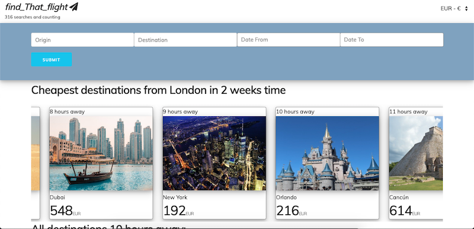
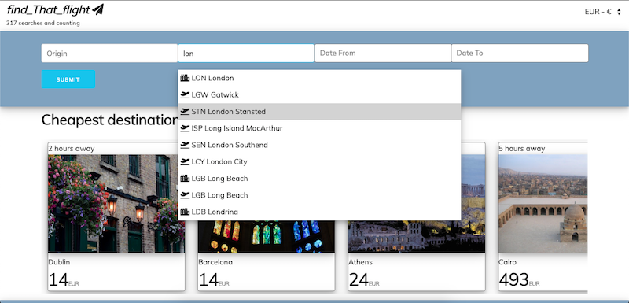
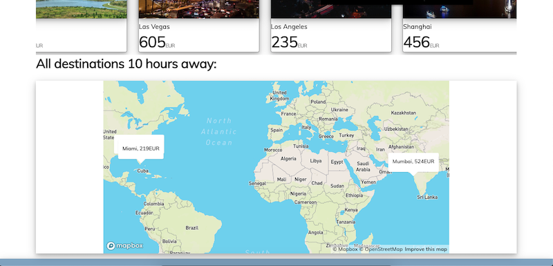
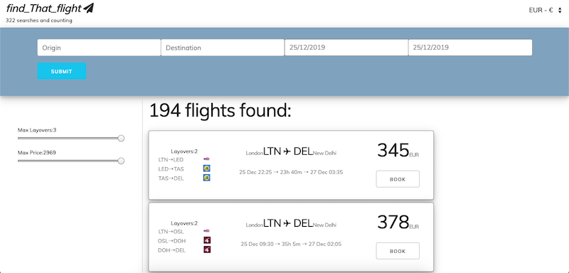
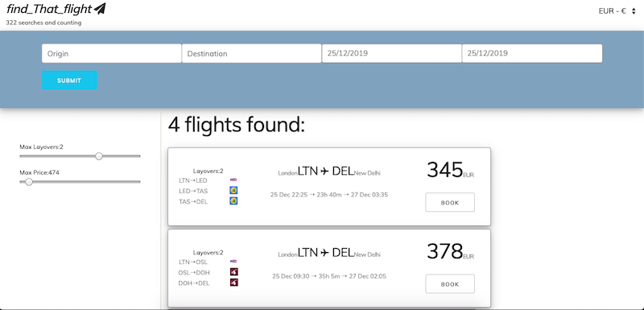

# SEI Project 4: Fin That Flight

## Overview 

A flight ticket search app for people without trip agenda.
It was a solo project that has been built over a 8 day project period and was my final project during my course at General Assembly. Since I'm, a frequent user of ticket search engines, I'm trying to make my own and as a result still adding features to it.



---
## Technologies Used

* HTML5
* SCSS and Skeleton Framework
* JavaScript
* React.js
* Python
* Django
* MySql
* PostgreSQL
* Axios
* [Kiwi Flights API](https://docs.kiwi.com/)
* [Kiwi Locations API](https://docs.kiwi.com/locations/)
* [Pixabay API](https://pixabay.com/api/docs/)
* [MapBox GL](https://docs.mapbox.com/mapbox-gl-js/api/)
* Git/GitHub

---
## Deployment

Web version can be found on [Heroku](https://findtahtflight.herokuapp.com/)

---
## Getting Started

Clone the repository and run on your machine. 

Install the packages listed in the package.json file by running the following terminal command:

$ yarn install

Run the app on with the following command:

$ yarn start

Start your browser and navigate to following address:

http://localhost:4000/

---
## Usage

Below are the main application features:
 ### Basic search.
 Search for one way flights within a time period. Available location endpoints: 
 * Country
 * City
 * Airport
Search is possible in multiple currencies:
 * GBP
 * EUR
 * USD
User search preferences are being kept in localStorage in order to get flight based on the most recent search criterias.

 ### Search based on flight suggestions.
 User is being served suggestions to flight destinations categorised by flight duration. Once user clicks one of the duration cards, the map opens below where he can brows all flight destinations within the same flight duration category. By clicking on another duggestions card user can see other category on the map. AMp automatically adjusts to accomodate all destinations on it.

### Browse and filter results.
Currently he available filters are based on layovers and price. More filters will be added in the future.




---
## Approach Taken

Below are the challenges that I have faced while working on this project.

### Front-end: engineering the multifunctional album card

One of the challenging parts during this project was implementing the dynamic Map feature that readjusts the map based one different location coordinates displayed on it. 

In order to achieve the above effect, Mapbox needs to be supplied with North_Eastern and South_Western points of the map. Below functions display how it is being achieved. This feature currently works best with the viewport limited to 680 width and 400 height. I am planning to make it responsive to screen changes in the future.

```
   getMapBounds() {
    const coordinatesArray = suggestionsByHour.map(point => [point.route[0].lngTo, point.route[0].latTo])
    const longitudes = (coordinatesArray.map(coords => coords[0]))
    const latitudes = (coordinatesArray.map(coords => coords[1]))
    const sw = [Math.min(...longitudes), Math.min(...latitudes)]
    const ne = [Math.max(...longitudes), Math.max(...latitudes)]
    const bounds = [sw, ne]
    return bounds
  }
  fitToBounds() {
    const { longitude, latitude, zoom } = new WebMercatorViewport({ 
      width: 680,
      height: 400,
      latitude: 50,
      longitude: 10,
      zoom: 1.89,
      bearing: 0,
      pitch: 0
    }).fitBounds(this.getMapBounds())
    return [longitude, latitude, zoom]
  }
  ```
---
## Challenges

At the start with this project I did not anticipate that the front end is going to be so challenging that I would run out of time to implement the back-end. I created the register and login routes for the users in the back-end for the future use. The only currently working back-end route is the search model that gets added to the database and the total number gets displayed under the logo on the top left corner.

---
## Future Improvements

In order to have the more function al app, there are some improvements that could be added to this in the future to make this app more functional;

* Return flight search feature;
* Multilanguage support;
* User login and ticket price change tracking features;

